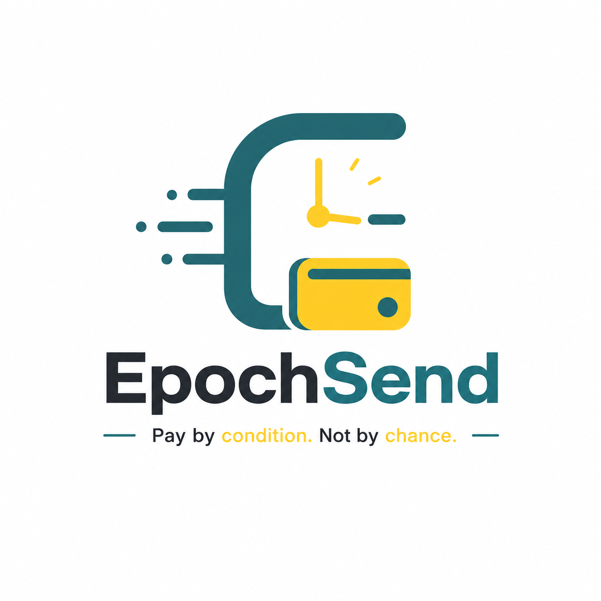

# EpochSend - Frontend Client



> **The Next.js user interface for the EpochSend Protocol on Stellar.**

**Live Demo:** [https://epochsend.vercel.app/](https://epochsend.vercel.app/)

[](LICENSE)
[](https://soroban.stellar.org)

## 💡 Overview

This repository contains the interactive Next.js application that allows users to seamlessly interact with the EpochSend conditional escrow smart contracts. 

Users can connect their Freighter wallets, define their payment intents (e.g., "Send 100 USDC on Friday"), and cryptographically sign the transactions that safely lock their funds on the Stellar blockchain.

---

## 🛠 Tech Stack

*   **Framework:** Next.js (React)
*   **Language:** TypeScript
*   **Styling:** Tailwind CSS (EpochSend Design System: Deep Green & Identity Teal)
*   **Wallet Integration:** Freighter Wallet
*   **Blockchain Integration:** `@stellar/stellar-sdk`

---

## 🚀 Getting Started

### 1. Prerequisites
*   Node.js v18+
*   npm or yarn
*   Freighter Wallet installed in your browser

### 2. Local Setup

```bash
cd frontend

# Install dependencies
npm install

# Run the development server
npm run dev
```

Open [http://localhost:3000](http://localhost:3000) with your browser to see the application.

---

## 📚 Documentation & Task Tracking

*   🎨 **[Frontend Issues Tracker](./docs/ISSUES-FRONTEND.md)**
*   🌐 **[Frontend Integration Guide](./docs/FRONTEND_GUIDE.md)**
*   📄 **[Product Requirements Document](./docs/PRD.md)**

---

## 🤝 Contributing

See [CONTRIBUTING.md](CONTRIBUTING.md) and [STYLE.md](STYLE.md).

---

*Project maintained by @babalola & contributors.*
