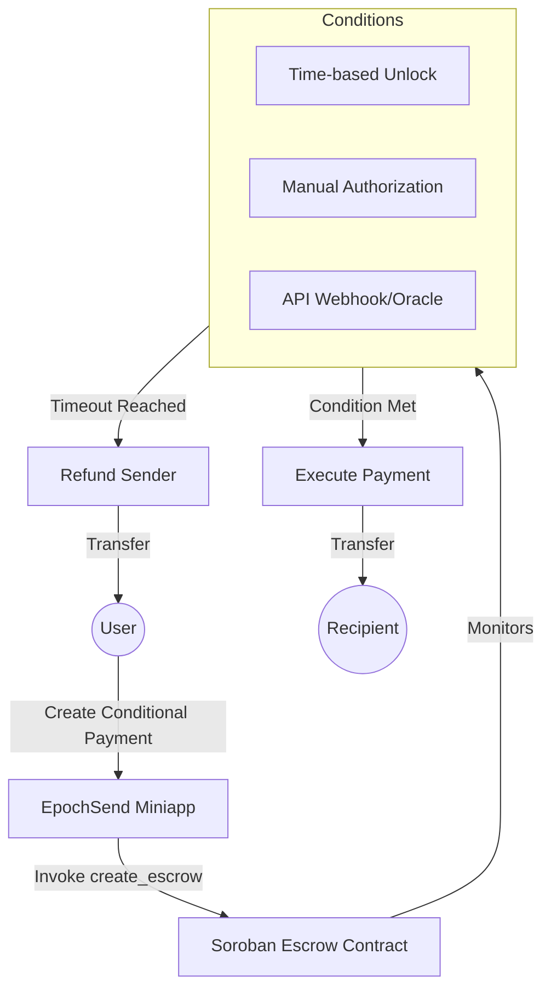

# 📘 Product Requirements Document (PRD)

## Product Name: EpochSend

---

## 🧠 Overview

**EpochSend** is an intent-based payment protocol on the **Stellar Network** that shifts the paradigm of payments from simply "sending money immediately" to "defining behavior that money follows." 

It allows users to define conditions under which funds are automatically executed on-chain. Instead of sending money manually, users define rules such as:
- “Send when delivery is confirmed”
- “Pay every Friday”
- “Release funds after milestone completion”

The system converts user intent into enforceable on-chain payment logic using **Soroban smart contracts**.

---

## 🎯 Problem Statement

Payments today are fundamentally flawed for complex transactions:
1. **Manual & Inefficient**: Sending recurring or milestone-based payments requires calendar reminders and manual intervention.
2. **Trust-Based**: Buying services online requires either trusting the seller (paying upfront) or trusting the buyer (delivering upfront).
3. **Non-Conditional**: Once money is sent, it's gone. There is no programmable fallback if agreements aren't met.

Users often rely on third-party escrow services that charge massive fees, or they fall victim to scams and disputes.

---

## 💡 The EpochSend Solution

Enable programmable payments based on strictly defined conditions using the speed and low cost of Stellar.

Users define:
- **Recipient**: The destination address.
- **Amount**: How much USDC or XLM.
- **Trigger Condition**: Time, Manual Approval, or Oracle Data.

The protocol:
1. Holds the funds safely in an **Escrow Smart Contract**.
2. Monitors the trigger condition passively or actively.
3. **Executes** the payment automatically when met, OR **Refunds** the sender if a dispute timeout is reached.

---

## 🏗️ Architecture

---

## 🧩 Core Features (MVP to Phase 3)

### 1. Conditional Escrow Contracts (Soroban)
- Creates discrete escrows for every transaction.
- Non-custodial: funds are locked by code, not a centralized entity.

### 2. Supported Conditions
**Phase 1: Time & Trust**
- **Time-based**: Execute exactly at a Unix timestamp.
- **Manual Trigger**: The designated arbiter or recipient must cryptographically sign to release funds.

**Phase 2: Oracles**
- **API Triggers**: Off-chain Node.js oracles that listen to webhooks (e.g., FedEx delivery confirmation, Zapier integration) and trigger the contract.
- **Location Verification**: GPS-based releases for local transactions.

### 3. Automated Refunds
- Every escrow has a `dispute_timeout`.
- If the condition is never met, the sender can retrieve their funds effortlessly.

---

## 🔁 User Flow

### Flow A: Creating an Escrow
1. User connects Freighter wallet to EpochSend Miniapp.
2. Clicks **"New Payment"**.
3. Inputs Recipient Address, Amount (100 USDC), and Condition (e.g., "Manual Approval").
4. User signs the transaction. Funds are deducted and locked in the Soroban contract.

### Flow B: Triggering Execution
1. The Arbiter/Recipient logs into EpochSend.
2. Navigates to the **"Active Escrows"** dashboard.
3. Finds the pending payment and clicks **"Confirm Condition Met"**.
4. Signs the transaction. The smart contract releases the 100 USDC to the Recipient.

---

## 🔐 Security Model

- **No Centralized Custody**: EpochSend developers cannot access locked funds.
- **Soroban Auth Framework**: Strict checks ensure only the defined trigger authority can execute a contract.
- **Reentrancy Protection**: Follows Checks-Effects-Interactions patterns in Rust.
- **Timeout Safety Net**: Funds can never be permanently frozen; the sender can always trigger a refund after the `dispute_timeout`.

---

## 📊 Success Metrics

- **Total Value Locked (TVL)**: Amount of USDC/XLM actively in escrow.
- **Execution Rate**: Percentage of escrows successfully executed vs refunded.
- **Active Users**: Number of unique wallet connections per month.
- **Transaction Volume**: Total dollar value processed by the protocol.

---

## 🚀 Roadmap

### Phase 1: MVP (Current)
- Basic Soroban `ConditionalPayment` contract.
- Time-based and Manual conditions.
- Next.js Miniapp Dashboard (Send/Receive tabs).

### Phase 2: Automation & Oracles
- Backend Oracle Node for API webhooks.
- Email/SMS notifications for escrow events.
- Recurring subscription payments.

### Phase 3: Developer Ecosystem
- EpochSend SDK for third-party dApps.
- Multi-signature approvals.
- Integration with Stellar fiat off-ramps (MoneyGram).

---

## 🎯 Positioning
**EpochSend** is the programmable financial layer for Stellar—turning intent into automated, trustless execution.
