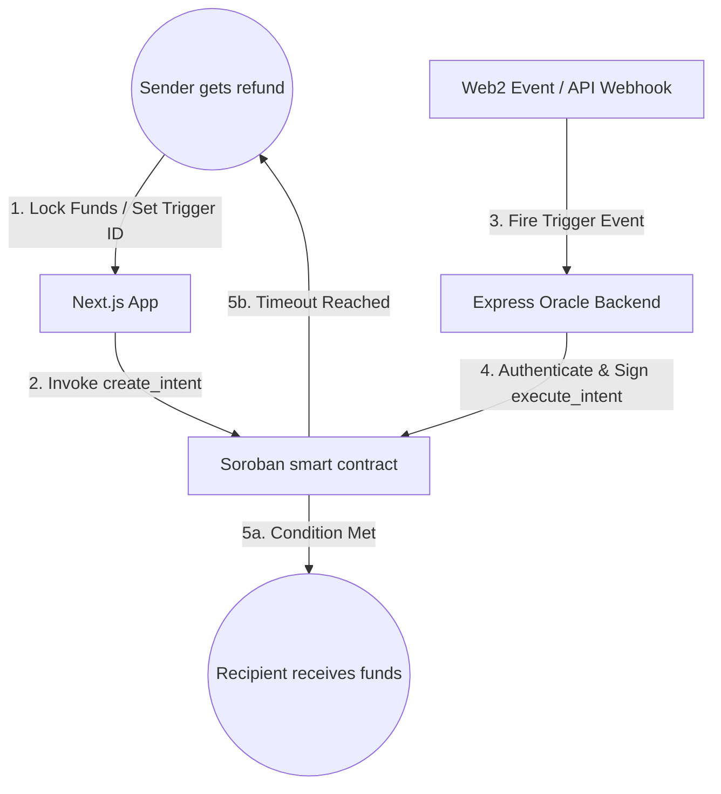

# 📘 Product Requirements Document (PRD)

**Live App:** [https://epochsend.vercel.app/](https://epochsend.vercel.app/)

## Product Name: EpochSend

---

## 🧠 Overview

EpochSend is an intent-based payment protocol on Stellar that shifts the focus from simply "sending money immediately" to "defining off-chain conditions that trigger on-chain transfers."

The core idea is to bridge Web2 events with Web3 payments. Instead of requiring manual escrow release or complex smart contract logic, EpochSend allows developers and users to tie payments directly to API webhooks (like a delivery API, a successful Stripe transaction, a closed GitHub issue, or server logs). 

Funds lock safely in a Soroban smart contract and release automatically when our Express oracle backend receives and authenticates the off-chain trigger.

---

## 🎯 Problem Statement

Everyday conditional payments are usually a pain to automate:
1. **API Incompatibility:** Blockchain networks cannot natively listen to Web2 API webhooks, so you can't easily pay someone automatically when a shipping API says "delivered."
2. **Trust-Based Escrow:** Typical online transactions require one party to trust the other. Pay upfront, and you hope they deliver. Deliver first, and you hope they pay.
3. **Friction and Fees:** Traditional escrow services are slow and take a massive cut just to act as manual arbiters.

---

## 💡 The EpochSend Solution

EpochSend offers a simple, automated escrow loop powered by Stellar:
* **The Lock:** The sender locks USDC or XLM in a Soroban contract, specifying a unique `oracle_id` and a fallback deadline.
* **The Monitor:** The Express oracle backend listens for off-chain trigger callbacks.
* **The Release:** Once the webhook fires and checks out, the oracle backend calls the smart contract to release the funds directly to the recipient.
* **The Fallback:** If the webhook never fires before the expiration timestamp, the sender retrieves the locked funds.

---

## 🏗️ Architecture

---

## 🧩 Core Features (MVP)

### 1. Soroban Escrow Engine
* Creates discrete on-chain intents mapping sender, recipient, asset, amount, and trigger parameters.
* Fully non-custodial: funds are locked in code and cannot be accessed by anyone except the recipient (on verified trigger) or the sender (on timeout).

### 2. Webhook-to-Blockchain Oracle
* Node.js / Express backend that exposes a secure ingestion endpoint for webhooks.
* Validates event payloads, maps them to on-chain intent IDs, and executes Soroban smart contract releases.

### 3. Expiration Safety Valve
* Each intent has a hard deadline. Senders can reclaim their funds if the Web2 event fails to trigger before the deadline.

---

## 🔁 User Flow

### Flow A: Creating the Payment
1. User connects Freighter wallet to the EpochSend UI.
2. Selects **"Create Payment"**, inputs the Recipient, the amount, the fallback deadline, and the webhook trigger ID.
3. User signs the transaction; funds lock in the Soroban smart contract.

### Flow B: Webhook Execution
1. The off-chain event occurs (e.g., a package is scanned as delivered).
2. The shipping API sends a POST webhook to the EpochSend Express backend.
3. The backend validates the webhook payload, matches the trigger ID, builds the release transaction, signs it, and submits it to Stellar.
4. The smart contract releases the funds to the recipient.

---

## 🔐 Security Model

* **No Platform Custody:** EpochSend operators never hold user funds.
* **Oracle Authorization:** Only the designated `oracle_id` address has permission to trigger a release.
* **Clamped Expirations:** Timeout limits are enforced on-chain. Funds can never be permanently locked if an oracle goes offline.

---

## 🚀 Roadmap

### Phase 1: MVP (Current)
* Pure Soroban contract with intent creation, execute, and refund flows.
* Express backend with webhook ingestion stubs and transaction building.
* Next.js user interface with Freighter integration.

### Phase 2: Production Integrations
* Live API handlers (FedEx, Zapier, Stripe, GitHub).
* Database layer to track Web2 webhook deliveries and prevent duplicate triggers.
* E-mail notification system for senders and recipients.

### Phase 3: Developer Tools
* SDK for developers to integrate EpochSend oracle escrows into their own Web2 platforms.
